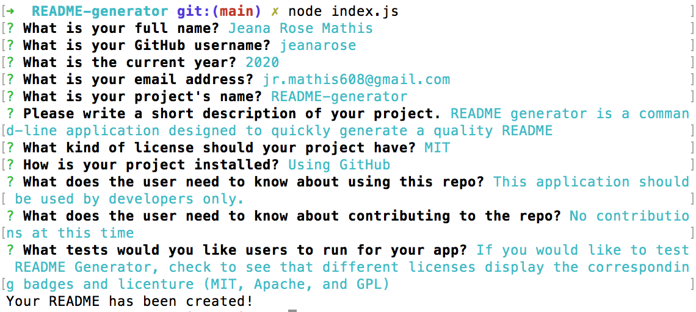
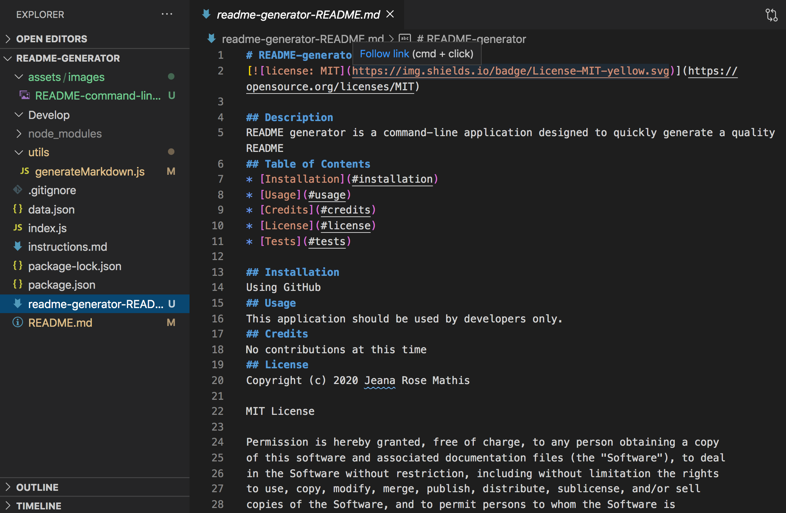

# README Generator

  
## Description
README Generator is a command-line application designed to create a professional README that displays user input. When a user runs index.js using NodeJS, they are prompted with a series of input questions that account for the README content. When the user answers a question, the answer is displayed in the README in the corresponding section. This application is useful for developers by quickly and easily generating a quality README for any project. 

The following technologies were used to make README Generator function as expected:
* Modules
* Template literals
* Arrow functions
* The spread operator
* The fs package
* The Inquirer package 
* Node JS

## README Generator

<kbd><kbd>

## Table of Contents
* [Installation](#installation)
* [Usage](#usage)
* [Credits](#credits)
* [License](#license)
* [Tests](#tests)

## Installation
1. Go to the [GitHub repository for README Generator](https://github.com/jeanarose/README-generator).
2. Click the green **Code** button.
3. Copy the SSH key.
4. In your terminal, go into the directory that you want to host README Generator. 
5. Use the command **git clone [insert SSH key URL]** and click **Enter** (*Requires Git*).## Usage
This application can only be used on the command-line and is built for developer use only.

## Usage
README Generator can be used to quickly create the basic contents of a quality README. 

## Credits
The following people contributed to the success of this application. You can view their GitHub profiles by clicking on their names:
* [Jonathan Watson](https://github.com/jonathanjwatson)
* [Pete Kriengsiri](https://github.com/pkriengsiri)

The following sites were used to find code to make Day Planner function properly:
* [GitHub:](https://gist.github.com/lukas-h/2a5d00690736b4c3a7ba) Markdown for licenses
## License
Copyright (c) 2020 Jeana Rose Mathis

MIT License
    
Permission is hereby granted, free of charge, to any person obtaining a copy
of this software and associated documentation files (the "Software"), to deal
in the Software without restriction, including without limitation the rights
to use, copy, modify, merge, publish, distribute, sublicense, and/or sell
copies of the Software, and to permit persons to whom the Software is
furnished to do so, subject to the following conditions:
    
The above copyright notice and this permission notice shall be included in all
copies or substantial portions of the Software.
    
THE SOFTWARE IS PROVIDED "AS IS", WITHOUT WARRANTY OF ANY KIND, EXPRESS OR
IMPLIED, INCLUDING BUT NOT LIMITED TO THE WARRANTIES OF MERCHANTABILITY,
FITNESS FOR A PARTICULAR PURPOSE AND NONINFRINGEMENT. IN NO EVENT SHALL THE
AUTHORS OR COPYRIGHT HOLDERS BE LIABLE FOR ANY CLAIM, DAMAGES OR OTHER
LIABILITY, WHETHER IN AN ACTION OF CONTRACT, TORT OR OTHERWISE, ARISING FROM,
OUT OF OR IN CONNECTION WITH THE SOFTWARE OR THE USE OR OTHER DEALINGS IN THE
SOFTWARE. 
## Tests
Change the license used
## Questions
If you have any questions, you can contact me at jr.mathis608@gmail.com. 
You can also view my GitHub profile at https://github.com/jeanarose.

---

© 2020 Trilogy Education Services, LLC, a 2U, Inc. brand. Confidential and Proprietary. All Rights Reserved.
  